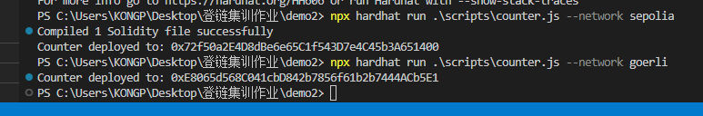
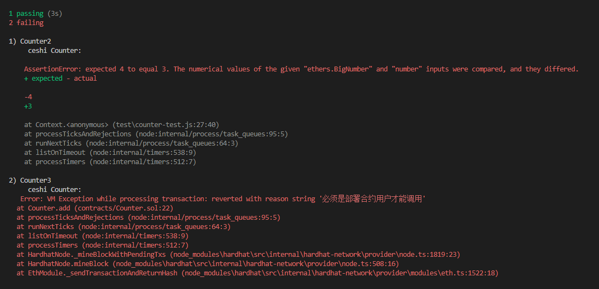

通过Hardhat部署合约：

sepolia交易哈希：0x09740447dedfa2ebe4de2eb989ace7d50a54373c93debe13972eef0ec67ac138

goerli交易哈希：0xa4de82ef25087a372b2955d0eaacabba40d6f7c99c529f29f392431bb2a785fa

 

goerli测试网合约地址：https://goerli.etherscan.io/address/0xE8065d568C041cbD842b7856f61b2b7444ACb5E1#code

 

sepolia测试网合约地址：https://sepolia.etherscan.io/address/0x72f50a2E4D8dBe6e65C1f543D7e4C45b3A651400#code

 

测试代码：

 

测试结果：看出第一个通过，第二个4!=3报错，第三个调用合约者不是部署合约者报错

