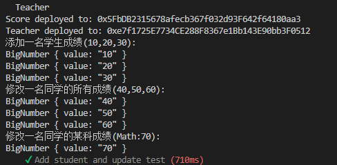
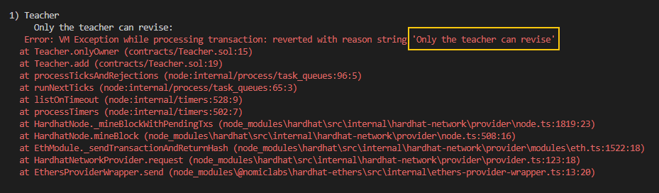
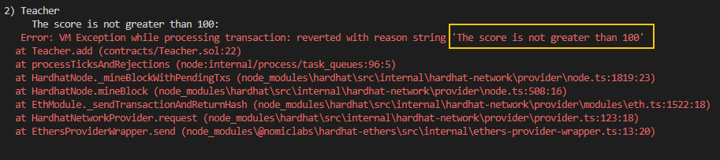
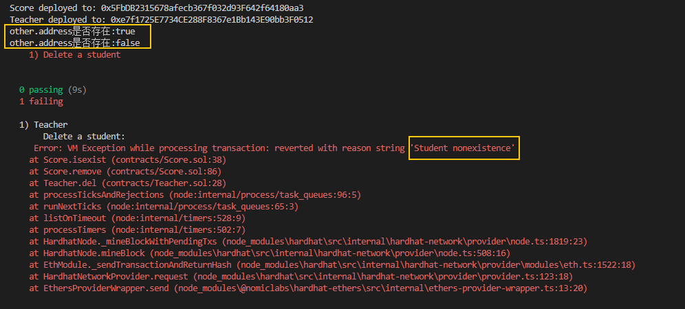

# 测试实例：

### 第一个测试用例：添加一名学生，然后修改这名学生的所有成绩，最后是修改这名同学的单科成绩

 

### 第二个测试用例是只有老师才能进行添加或修改学生成绩

 

### 第三个测试用例是添加过着修改成绩不能大于100

 

### 第四个测试先添加学生然后删除学生，删除后再删除这位学生报错

 

> 因为最近上学有点忙，不知道有没有迟到，希望还来得及，麻烦助教了0_0
