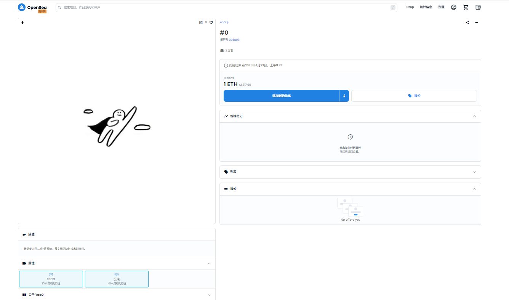

# 合约列表：

 

# 测试：

第一个测试是基础的先授权在转账成功，第二个是通过回调函数一步成功转账

 

第二个测试是通过签名授权再转账成功...

看了个文章了解到，这样做也是要两部调用合约，但是两步都是提款方调用不需要授权调用，授权只需把签名给提款方，这样的话因为签名可以线下，所以可以节省一点Gas，我的理解是这样不知道对不对0.0

 

第三个测试是NFT交易，大概流程是最终买家授权卖家转账Token，卖家进行提现后自动将NFT主人转给买家

我一开始打算的是通过部署一个中转合约进行Token与NFT之间交互，铸造NFT的时候主人是中转合约，然后在这个合约进行限制，但这样的话好像只有固定Token才能交互....感觉我写的，嗯，一言难尽，还要再完善0_0

 

ERC721部署在Goerli合约地址：0x8A96937304F2FfDBA6Fa4BDe7B760814c18902fE

NFT链接地址：https://testnets.opensea.io/zh-CN/assets/goerli/0x8a96937304f2ffdba6fa4bde7b760814c18902fe/0

  
