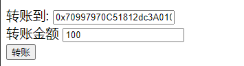
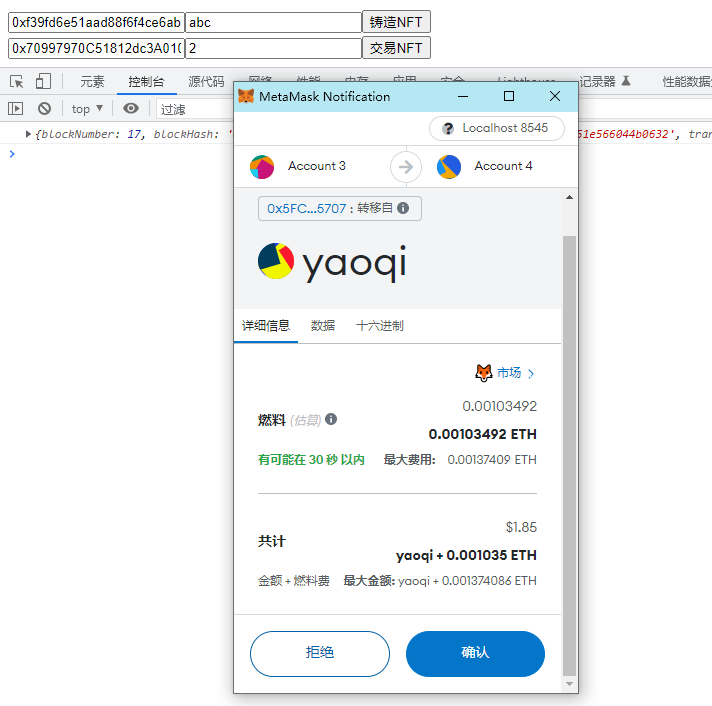

# 部署合约

在本地部署的合约ERC2612、Vault、ERC721合约

 

# 普通转账Token

#### 转账100Token

  

 

 

# ERC2612授权转账给Valut

#### 转账前

 

### 签名

 

### 交易

 

### 转账后：

 

#  解析ERC721 转账事件并上传到数据库

#### 铸造一个NFT

 

#### 交易一个NFT

 

