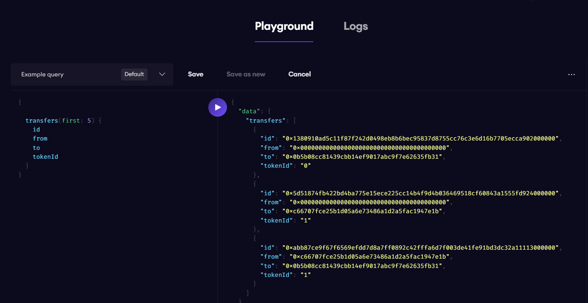
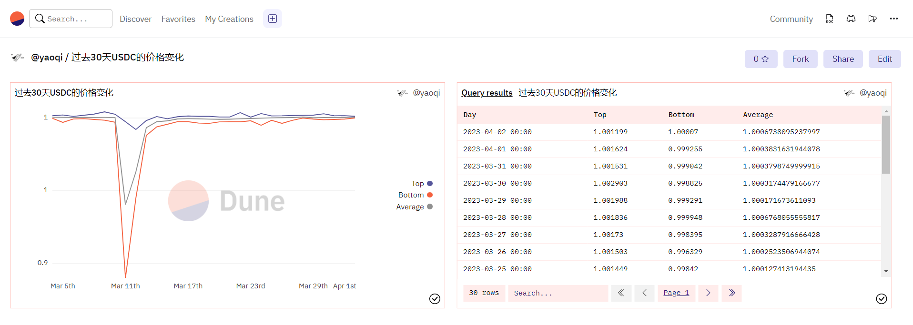

# 结果

#### ERC721合约地址(Mumbai)：

https://mumbai.polygonscan.com/address/0x72f50a2e4d8dbe6e65c1f543d7e4c45b3a651400#events

#### 区块链浏览器中的事件显示：

铸造两个NFT，交易一个NFT，共三个事件

 

#### TheGraph中Playground中查询事件：

链接 : https://thegraph.com/hosted-service/subgraph/kpyaoqi/w4-2

  

#### Vue前端通过TheGraph查询显示结果：

   

  

## Dune

结果链接 : https://dune.com/yaoqi/guo-qu-30tian-usdcde-jie-ge-bian-hua

