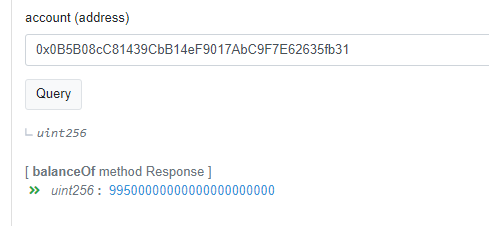
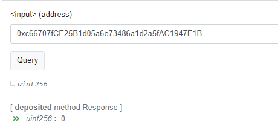
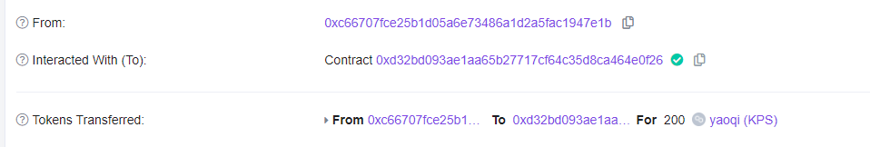
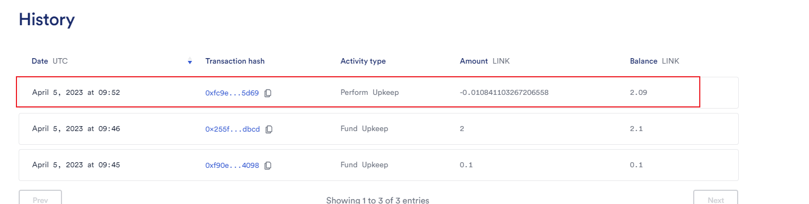
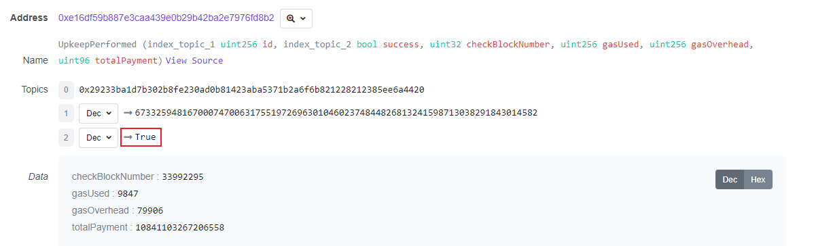
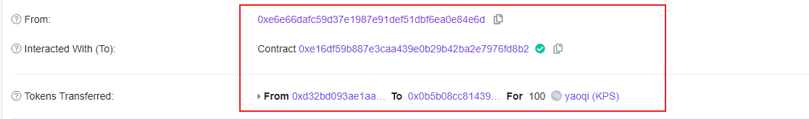
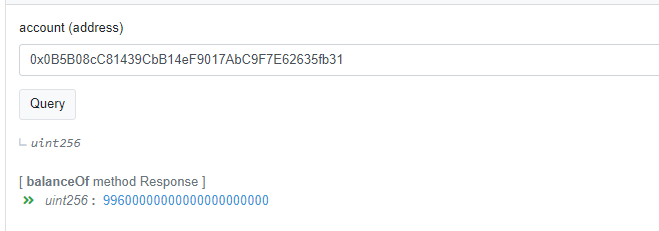

# ChainLink Automation

**Upkeep地址**：https://automation.chain.link/mumbai/67332594816700074700631755197269630104602374844826813241598713038291843014582

## 当前状态

#### vault的owner地址拥有的Token：99500KPSToken

#### (默认是10000KPSToken，转了500KPSToken给0xc66707fCE25B1d05a6e73486a1d2a5fAC1947E1B)

 

#### Vault中0xc66707fCE25B1d05a6e73486a1d2a5fAC1947E1B余额：0KPSToken

 

#### 0xc66707fCE25B1d05a6e73486a1d2a5fAC1947E1B向vault存200KPSToken

 

#### Upkeep检测多出一条记录

 

#### 判断AutoCollectUpKeep符合条件

 

#### 自动将Vault的余额的一半(100KPSToken)转给了owner

 

#### ERC20合约中Vault的owner地址余额为9600KPSToken

 

# Gelato Network

地址：https://app.gelato.network/task/0xcb47e77de1118bc3a217cf217a19a837f2803e551b68d8f81b44c24134293451?chainId=80001

# OpenZepplin Defender

地址：https://defender.openzeppelin.com/#/autotask/f12072ce-ae1f-4843-aba5-f26cf8610b12
