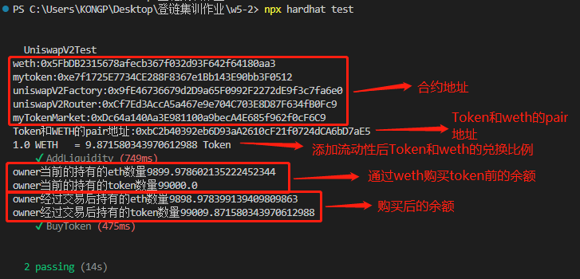
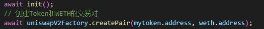
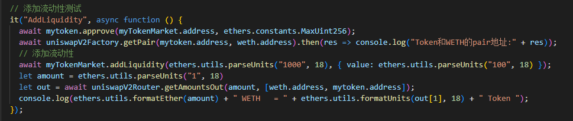
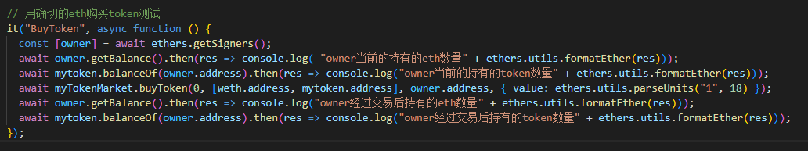

# 结果

部署了五个合约，分别是weth、Token、uniswapV2Factory、uniswapV2Route、MyTokenMarket合约

 

通过uniswapV2Factory创建Token和weth交易对

 

授权MyTokenMarket对token进行转账，添加流动性( 1000 ERC20Token，100 ETH )，获取兑换比例

 

通过myTokenMarket合约调用uniswapV2Route合约用weth购买Token

 
