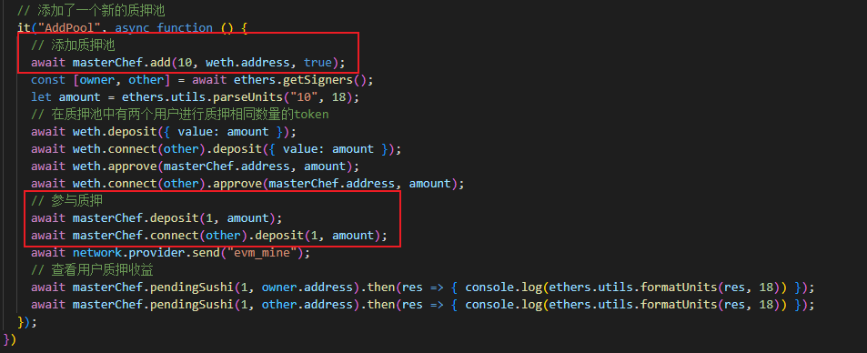

# 测试

第一步初始部署各个合约

AddLiquidity：添加weth和myToken的流动性

BuyToken：完成代币兑换后，直接质押到 MasterChef 挖矿

AddUser：在质押池中添加了两个质押了相同数量token的用户

AddPool：新添加了一个质押池

  

# BuyToken：

before中添加了token的质押池

 

在完成代币兑换后，直接质押到 MasterChef 挖矿

经过两个个区块后通过调用MyTokenMarket合约withdraw()方法解除质押获得的sushi收益为131.999sushi(每个块分配sushi的数量为40sushi)，包括解除质押的那个块一共获得三个出块奖励

 

 

# AddUser:

两个用户质押相同数量的token

 

因为owner先进行质押，所以比other多获得一整个出块奖励，所以owner获得40 × 3/2 = 60，other获得40 × 3/2 - 40×1 = 20

 

# AddPool：

新添加一个质押池，并且质押相同数量的weth

 

新添的weth质押池和token质押池获得质押挖矿的比例各为1/2，因为添加质押池时_allocPoint参数都为10

因为owner先进行质押，所以比other多获得一整个出块奖励，所以owner获得(40×1/2) × 3/2 = 30，other获得(40×1/2) × (3/2 - 1) = 10，

 
