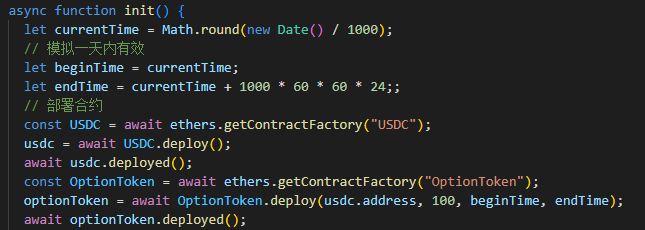
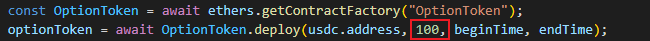
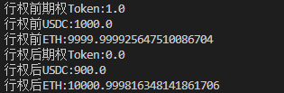
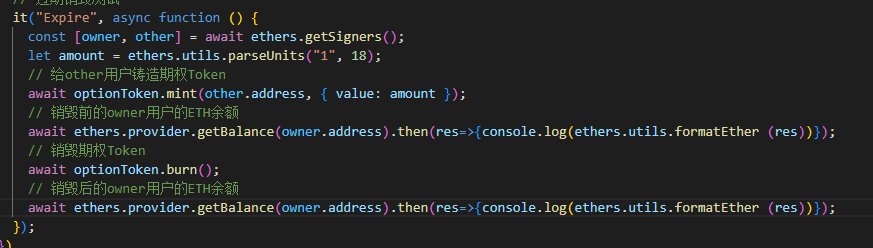
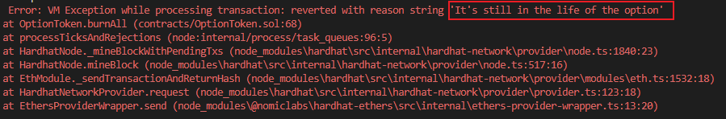
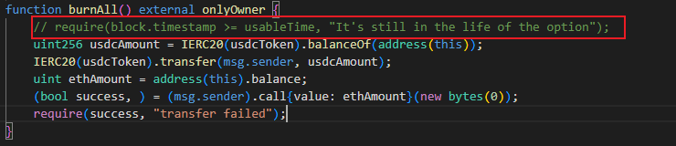
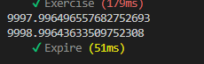

# 测试

部署USDC和期权Token合约

 

# 行权测试

 

### 结果

设置的价格是1ETH=100USDC

 

 

可以看到期权Token从1变0，用户通过期权Token用100USDC购买了1ETH

# 过期销毁测试

 

### 结果

还在期权可行权时间内，报错

 

注释掉判断时间有效的语句，再运行一次

 

owner用户增加1ETH

 
